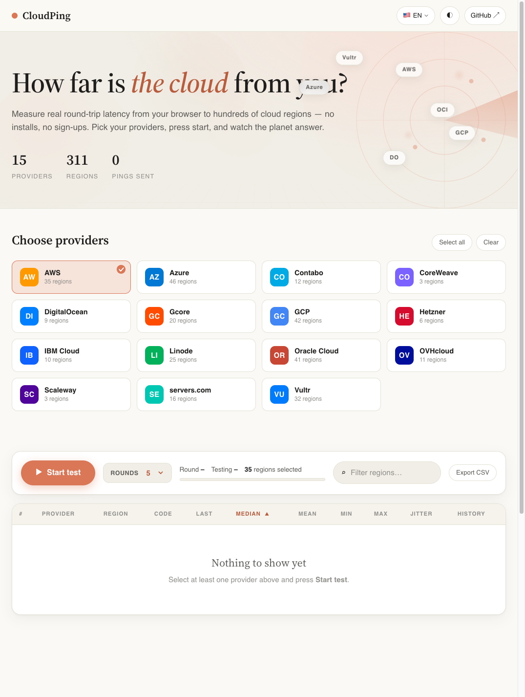
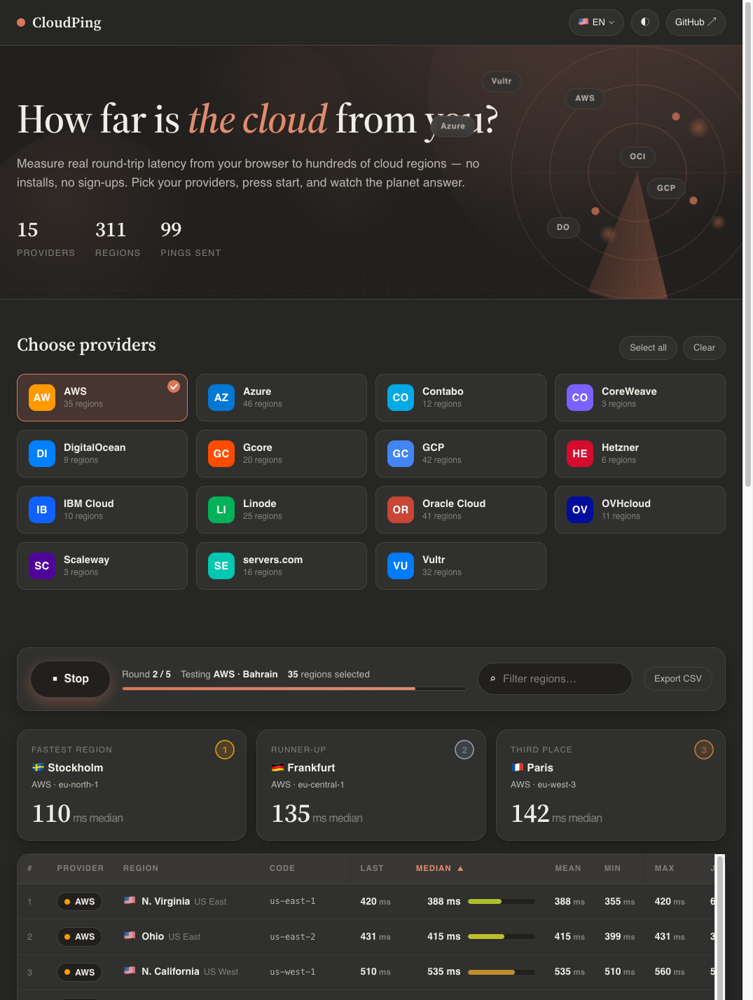
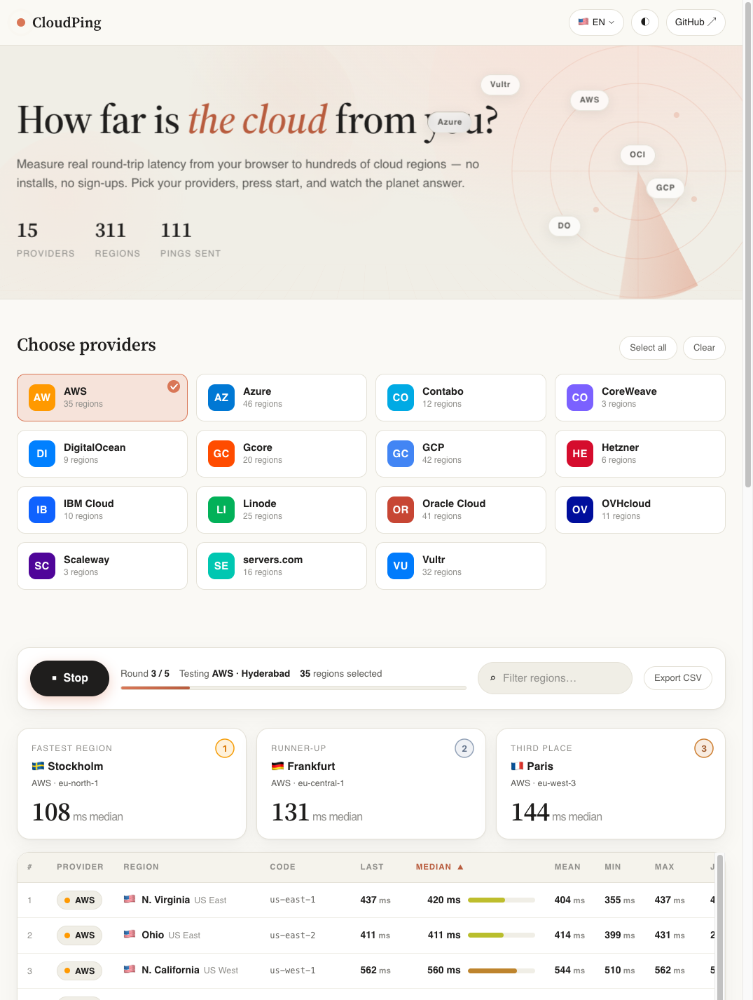
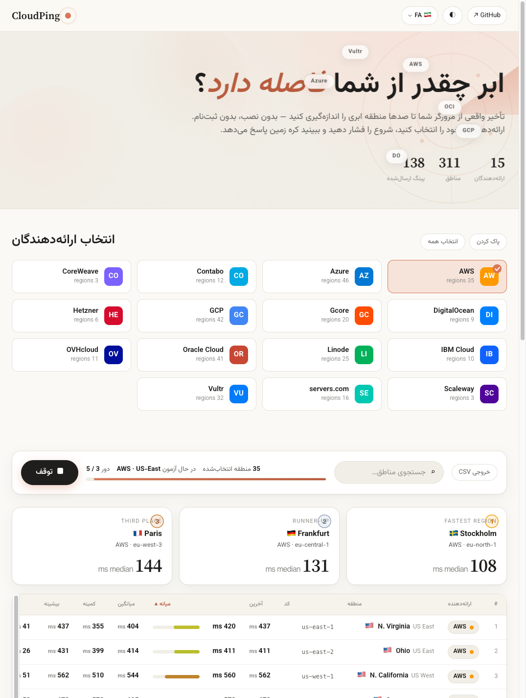

# CloudPing — Cloud Latency Test

> Measure real round-trip latency from your browser to **311 regions across 15 cloud providers** — no installs, no sign-ups, completely free.

**🔗 Live demo:** [letmefind.github.io/CloudPingTest](https://letmefind.github.io/CloudPingTest/)

---

## What it does

CloudPing sends image-beacon pings from your browser to public endpoints of every selected cloud region and measures the actual round-trip time using `performance.now()`. Results update live as each round completes.

**Supported providers (311 regions total):**

| Provider | Regions | Provider | Regions |
|---|---|---|---|
| AWS | 35 | Oracle Cloud | 41 |
| Azure | 46 | OVHcloud | 11 |
| GCP | 42 | Scaleway | 3 |
| Vultr | 32 | Hetzner | 6 |
| Linode (Akamai) | 25 | IBM Cloud | 10 |
| Gcore | 20 | CoreWeave | 3 |
| DigitalOcean | 9 | servers.com | 16 |
| Contabo | 12 | | |

---

## Features

### Core
- ⚡ **Live latency measurements** — ping starts immediately, results update every round
- 🎛️ **Configurable rounds** — set 1, 3, 5, 10, 20, 50, or ∞ rounds before starting (default: 5)
- 📊 **Full statistics** — Median · Mean · Min · Max · Jitter per region
- 🏆 **Live podium** — top 3 fastest regions with medals, updated every round
- 📈 **Sparkline history** — mini chart showing latency trend per region
- 🔍 **Filter & sort** — search regions by name/code, click any column to sort
- 📥 **CSV export** — download all results as a spreadsheet

### Design & UX
- 🎨 **Claude-inspired design** — warm light/dark themes, serif typography, micro-animations
- 🌐 **3D cinematic hero** — radar sweep, parallax layers, mouse-tracking card tilt
- 🌍 **13 languages** — including full RTL support for Persian (فارسی) and Arabic (العربية)
- ♿ **Accessible** — ARIA roles, keyboard navigation, focus indicators, `prefers-reduced-motion`
- 📱 **Mobile-friendly** — responsive down to 375px

### Smart Analysis (AI — free, no key needed)
- 🧠 **Smart Analysis engine** — asks questions about your results and gets intelligent answers
- 📍 **IP geolocation** — detects your city, country and ISP automatically
- 💡 **Personalized recommendations** — best regions for your connection, provider rankings, jitter analysis
- 🤖 **Optional Claude 3.5 Sonnet upgrade** — add your own Anthropic API key for deeper AI analysis

### Privacy & Persistence
- 💾 **localStorage** — saves selected providers, theme, sort order, rounds, and language preference
- 🔑 **API key stays local** — Claude API key is stored only in your browser, never sent to any server

---

## Screenshots

**Light mode — home**



**Dark mode — live results with podium**



**Light mode — test running**



**فارسی (Persian RTL)**



---

## How it works

The classic image-beacon technique:

1. A tiny resource is loaded from each region's public URL (e.g. `https://s3.amazonaws.com/`)
2. `performance.now()` measures the round-trip time in milliseconds
3. A warm-up round (discarded) establishes DNS/TLS before measurements begin
4. Results are collected and statistics computed after each round

---

## Run locally

Pure HTML/CSS/JS — any static server works:

```bash
# Python
python3 -m http.server 8000
# open http://localhost:8000

# Node.js
npx serve .

# VS Code
# Install "Live Server" extension → click "Go Live"
```

---

## Deploy your own copy

### GitHub Pages (recommended)

1. Fork this repository
2. Go to **Settings → Pages**
3. Set source to **Deploy from a branch → `master` / `root`**
4. Your site will be live at `https://YOUR-USERNAME.github.io/CloudPingTest/`

### Any static host

Upload all files as-is to Netlify, Vercel, Cloudflare Pages, or any CDN. No build step required.

---

## Configuration

### IP Geolocation API key

The Smart Analysis feature uses [ipgeolocation.io](https://app.ipgeolocation.io/) as the primary geolocation source (especially important for users in Iran and regions where other free APIs are blocked).

The API key in `assets/app.js` is a **free-tier key** that may hit rate limits under heavy use. To use your own key:

1. Sign up free at [app.ipgeolocation.io](https://app.ipgeolocation.io/)
2. Copy your API key
3. In `assets/app.js`, find the `detectUserGeo` function and replace the key in this line:

```javascript
"https://api.ipgeolocation.io/ipgeo?apiKey=YOUR_KEY_HERE",
```

### Claude 3.5 Sonnet (optional)

Users can optionally enable Claude AI analysis from within the UI:

1. Open the **Smart Analysis** panel
2. Click **"Upgrade to Claude 3.5 Sonnet (optional)"**
3. Enter a valid [Anthropic API key](https://console.anthropic.com/)
4. Click **Save** — the key is stored locally in the browser

> ⚠️ The Anthropic API is called **directly from the user's browser**. The user's key is never sent to any server other than Anthropic's own API.

---

## Project structure

```
CloudPingTest/
├── index.html          # Single-page app (all UI markup)
├── assets/
│   ├── styles.css      # Design system + 3D effects + RTL support
│   ├── app.js          # All app logic (ping engine, UI, Smart Analysis)
│   ├── data.js         # All 311 regions + endpoints (extracted from PHP sources)
│   └── i18n.js         # 13-language translations
├── favicon.svg
├── *.php               # Original PHP files (kept for reference / endpoint catalog)
└── README.md
```

---

## Tech stack

| Layer | Technology |
|---|---|
| UI framework | Vanilla HTML / CSS / JS (zero dependencies) |
| Fonts | [Source Serif 4](https://fonts.google.com/specimen/Source+Serif+4) · [Vazirmatn](https://fonts.google.com/specimen/Vazirmatn) (Persian/Arabic) |
| AI | [Anthropic Claude 3.5 Sonnet](https://www.anthropic.com/) (optional, user key) |
| Geolocation | [ipgeolocation.io](https://ipgeolocation.io/) · ipwho.is · freeipapi.com (fallbacks) |
| Hosting | GitHub Pages |
| Build | None — edit files, push, done |

---

## Credits

- **Original project, region catalog & endpoints:** [VarunAgw/CloudPingTest](https://github.com/VarunAgw/CloudPingTest) — please consider [donating](https://varunagw.com/donate) to support the original work.
- **Modern redesign:** rebuilt as a static SPA with Claude-inspired design, 3D effects, Smart Analysis and multi-language support.

---

## License

This fork inherits the license of the [original project](https://github.com/VarunAgw/CloudPingTest). Check the upstream repository for license details.
